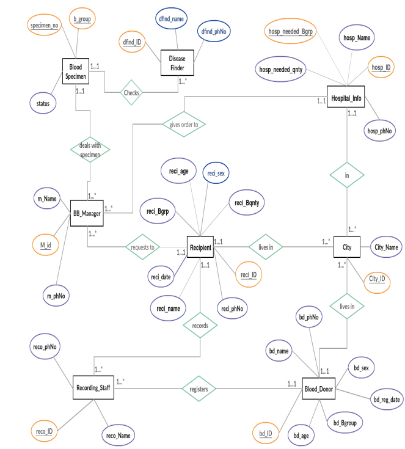
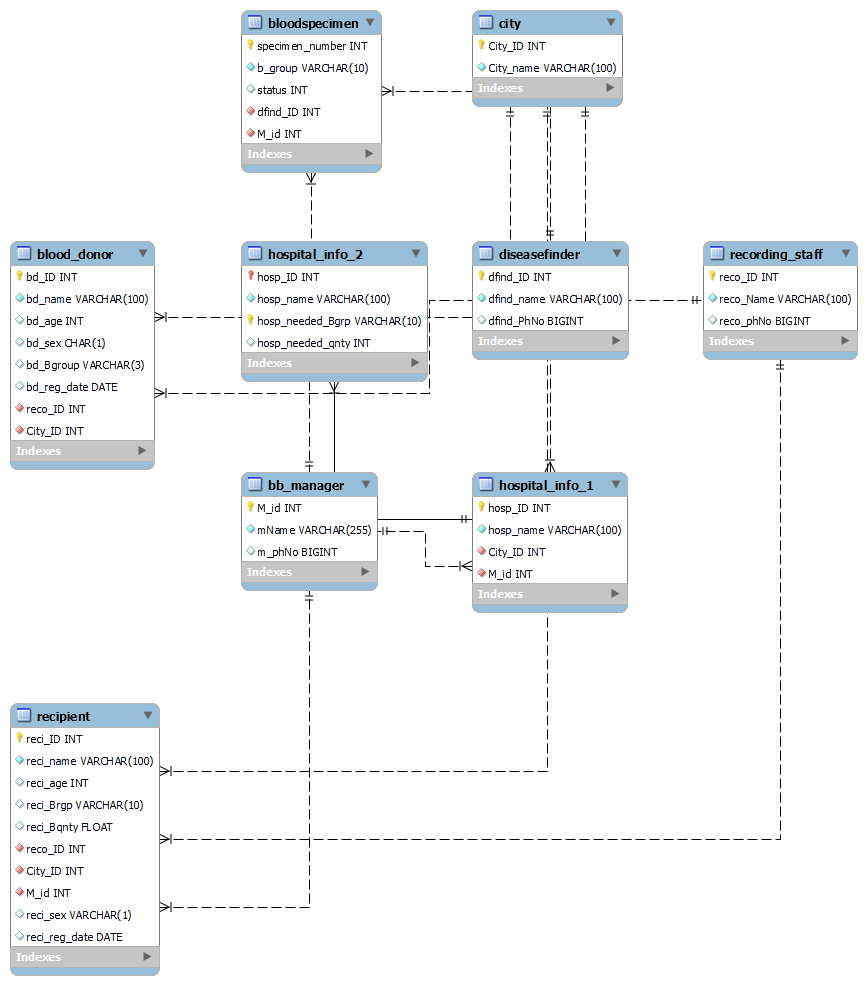

# Blood Bank Management System

  

A production-grade relational data model that turns manual blood-bank tracking into a queryable, integrity-safe system—built for fast donor/recipient matching, inventory accountability, and analytics-ready reporting.

## Screenshots


*Capture: the latest ER diagram showing all entities, primary keys, and relationships (replace if the schema changes).*


*Capture: the schema overview or sample data view that highlights donors, recipients, and specimen status.*

## Key Features (STAR)

- **S/T:** Manual blood-bank records make traceability and compliance slow and error-prone. **A:** Designed **9 normalized entities** with strict PK/FK constraints spanning donors, recipients, staff, managers, specimens, hospitals, and cities. **R:** Enforces referential integrity across the full supply chain and eliminates orphaned records during joins.
- **S/T:** Hospitals need multi-blood-group demand tracking without duplication. **A:** Split hospital requirements into **Hospital_Info_1** and **Hospital_Info_2** with a composite key for blood-group demand. **R:** Enables per-hospital, per-blood-group inventory requests without data redundancy.
- **S/T:** Screening status must be auditable for safety and accountability. **A:** Modeled **BloodSpecimen ↔ DiseaseFinder** with explicit status flags and manager ownership. **R:** Supports contamination tracking and clear ownership for every specimen.
- **S/T:** Demos and analytics need realistic data fast. **A:** Seeded the schema with multi-city donors, recipients, managers, and specimen records. **R:** Immediate, query-ready datasets for demos and reporting without extra setup.

## Repository Layout

- `blood-database.sql` — full schema + seed data for the Blood Bank Management System
- `blood-management.png` / `blood.png` — ER diagram and schema/overview visuals

## Installation & Usage

1. **Create the database and tables**
   ```bash
   mysql -u <user> -p < blood-database.sql
   ```

2. **Verify tables**
   ```sql
   USE BloodBankManagementSystem;
   SHOW TABLES;
   ```

3. **Run your queries**
   ```sql
   SELECT * FROM Blood_Donor LIMIT 5;
   SELECT * FROM BloodSpecimen WHERE status = 1;
   ```

## Tech Stack

- SQL (MySQL-compatible)
- Relational data modeling & normalization (3NF)

---

If you'd like, I can add optimized indexes or sample analytics queries based on your target use cases.
